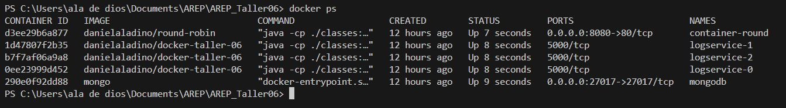

# TALLER 6: Taller de trabajo individual en patrones arquitecturales

Se creo una aplicación web usando el micro-framework de Spark java (http://sparkjava.com/). La cual fue desplegada en AWS utilizando EC2 y Docker.

Esta aplicación incluye un balanceador de carga Round Robin que distribuye equitativamente la carga de trabajo entre tres instancias del servicio LogService, el cual opera como un servicio REST que recibe y gestiona cadenas de texto, almacenándolas en una base de datos MongoDB.


---
### Prerrequisitos

* [Maven](https://maven.apache.org/)

* [Git](https://learn.microsoft.com/es-es/devops/develop/git/what-is-git)

* [Java -17](https://www.cursosaula21.com/que-es-java/)

* [Docker](https://aws.amazon.com/es/docker/)

* [DockerHub](https://flexa.cloud/es/%C2%BFQu%C3%A9-es-el-centro-de-la-ventana-acoplable%3F/)

* [Docker Compose](https://imaginaformacion.com/tutoriales/que-es-docker-compose)

* [AWS](https://aws.amazon.com/es/training/awsacademy/)

---

### Instalación y Ejecución

1.Clonamos el repositorio

```
https://github.com/AREP2024-1/AREP_Taller06.git
```

2.Ingresamos a la carpeta del repositorio que clonamos anteriormente

```
cd AREP_Taller06
```

**Nota :** Este proyecto nos ofrece dos alternativas para la instalción y ejecución  de este, las cuales son:


***A. Trayendo las imagenes de DockerHub***

1.Ejecutamos el docker-compose

```
docker-compose up -d
```

2.Verificamos que los contenedores se esten ejecutando

```
docker ps
```


3.Probamos nuestra aplicación accediendo a la siguiente URL en el navegador

```
 http://localhost:8080/index.html
```


***B. Construyendo las imagenes (docker-compose.build)***

Para construir las imagenes de docker usando el archivo **docker-compose.build**, debemos realizar los siguientes pasos:

1.Nos movemos a la carpeta appRoundRobin

```
cd appRoundRobin
```

2.Construimos el proyecto

```
mvn package
```

3.Luego no movemos nuevamente a la carpeta raiz

```
cd ..
```

4.Ahora nos movemos a la carpeta logService

```
cd logService
```

5.Construimos el proyecto

```
mvn package
```

6.Nos movemos nuevamente a la carpeta raiz

```
cd ..
```

7.Ejecutamos el docker-compose.build

```
docker-compose -f docker-compose.build.yml up -d
```

8.Verificamos que los contenedores se esten ejecutando

```
docker ps
```


9.Probamos nuestra aplicación accediendo a la siguiente URL en el navegador

```
 http://localhost:8080/index.html
```


---

### Usabilidad

Para probar la aplicación debemos ingresar una cadena en el campo de texto y luego damos click en el boton submit.

Como podemos observar en la siguiente imagen luego de dar click en submit con la cadena “prueba-10”, esta se agrega al final de la lista de logs. Así mismo al enviar la cadena esta se almacena en la base de datos con la fecha y hora exacta.

En pantalla vamos a ver el id y la información del log como la fecha y hora, el puerto y el mensaje de este.


Adicional a esto también podemos observar como el balanceador de carga Round Robin distribuye la carga de trabajo entre las instancias de servicio de logs, como se puede visualizar en la siguiente imagen


La aplicación está construida para que nos muestre en pantalla los últimos 10 logs, por lo tanto, al ingresar la cadena “prueba-11”, el log de la cadena “prueba-1” se dejara de ver en la lista de logs que aparece en pantalla.


---
### Ejecución de Test

1.Desde la raiz nos movemos a la carpeta appRoundRobin

```
cd appRoundRobin
```

2.Ejecutamos las pruebas con el siguiente comando

```
mvn test
```

3.Nos devolvemos nuevamente a la carpeta raiz

```
cd ..
```

4.Ahora nos movemos a la carpeta logService

```
cd logService
```

5.Ejecutamos las pruebas con el siguiente comando

```
mvn test
```
---
### Despliegue en AWS

En el siguiente link encontrara el video donde se evidencia el despliegue en AWS:

```
https://youtu.be/cW1mk80LFdU
```

---
### Arquitectura

Esta arquitectura incluye un algoritmo de balanceo de carga Round Robin junto con un servicio LogService que almacena cadenas en una base de datos MongoDB. Para esto se crearon dos proyectos uno para el round robin y otro para el log services, los cuales se describirán de una manera más detallada más adelante.

Es importante tener en cuenta que se crean dos proyectos debido a que se está trabajando con microservicios.  Esto nos permite conectar varias instancias de una manera más sencilla y eficiente.

**Componentes**
* **Round Robin:** Balanceador de carga Round Robin que distribuye las solicitudes entre múltiples instancias de LogService.
En este caso utilizamos 3 instancias estáticas del servicio LogService. La distribución de las solicitudes se realiza de manera secuencial, comenzando desde la primera instancia, pasando por la segunda y llegando a la tercera, para luego volver nuevamente a la primera. Este enfoque asegura una distribución equitativa de la carga entre todas las instancias disponibles, optimizando así el rendimiento y la disponibilidad del sistema. Así mismo cada una de las cadenas serán enviadas a través de un formulario que se implementó para la aplicación.

* **LogService:** Servicio REST que recibe cadenas, las almacena en una base de datos MongoDB y devuelve las últimas 10 cadenas almacenadas junto con sus fechas.

* **MongoDB:** Base de datos NoSQL utilizada para almacenar las cadenas procesadas por el servicio LogService.


**Estructura Proyecto Round Robin :**

El proyecto está estructurado en diferentes paquetes y clases:

***Main:*** Clase principal que inicia la aplicación y configura el controlador Spark.

**1. apiExtenal**
* **HttpClient:** Clase para realizar llamadas HTTP utilizando OkHttp.

**2. controller**
* **MyController:** Interfaz que define los métodos para los controladores.

* **MySparkController:** Implementación de un controlador Spark para manejar las solicitudes y utilizar el algoritmo de Round Robin.

**3. service**
* **AppRoundRobin:** Clase que implementa el algoritmo de Round Robin para distribuir las solicitudes entre las instancias de LogService.

* **LogsService:** Clase que representa un servicio LogService y realiza llamadas a otras instancias utilizando el HttpClient.


**Estructura Proyecto Log Service :**

El proyecto está estructurado en diferentes paquetes y clases:

**Main:** Clase principal que inicia la aplicación LogService.

**1. controller**
* **MyController:** Interfaz que define los métodos para los controladores.

* **MySparkController:** Implementación de un controlador Spark para manejar las solicitudes al servicio LogService.

**2. persistence**
* **CRUDOperations:** Interfaz para operaciones CRUD (Crear, Leer, Actualizar, Eliminar) en la base de datos MongoDB.

* **GestionLogs:** Implementación de operaciones CRUD utilizando MongoDB para gestionar los registros de logs.

* **MongoUtil:** Clase para realizar la conexión a la base de datos MongoDB.

**3. service**
* **LogsService:** Clase que representa el servicio LogService y realiza operaciones de guardar y obtener los ultimos 10 logs.

---

### Construido con

* [Maven](https://maven.apache.org/): Es una herramienta de comprensión y gestión de proyectos de software. Basado en el concepto de modelo de objetos de proyecto (POM), Maven puede gestionar la construcción, los informes y la documentación de un proyecto desde una pieza de información central.

* [Git](https://learn.microsoft.com/es-es/devops/develop/git/what-is-git): Es un sistema de control de versiones distribuido, lo que significa que un clon local del proyecto es un repositorio de control de versiones completo. Estos repositorios locales plenamente funcionales permiten trabajar sin conexión o de forma remota con facilidad.

* [GitHub](https://platzi.com/blog/que-es-github-como-funciona/): Es una plataforma de alojamiento, propiedad de Microsoft, que ofrece a los desarrolladores la posibilidad de crear repositorios de código y guardarlos en la nube de forma segura, usando un sistema de control de versiones llamado Git.

* [Java -17](https://www.cursosaula21.com/que-es-java/): Es un lenguaje de programación y una plataforma informática que nos permite desarrollar aplicaciones de escritorio, servidores, sistemas operativos y aplicaciones para dispositivos móviles, plataformas IoT basadas en la nube, televisores inteligentes, sistemas empresariales, software industrial, etc.

* [JavaScript](https://universidadeuropea.com/blog/que-es-javascript/): Es un lenguaje de programación de scripts que se utiliza fundamentalmente para añadir funcionalidades interactivas y otros contenidos dinámicos a las páginas web.

* [HTML](https://aulacm.com/que-es/html-significado-definicion/): Es un lenguaje de marcado de etiquetas que se utiliza para crear y estructurar contenido en la web. Este lenguaje permite definir la estructura y el contenido de una página web mediante etiquetas y atributos que indican al navegador cómo mostrar la información.

* [Visual Studio Code](https://openwebinars.net/blog/que-es-visual-studio-code-y-que-ventajas-ofrece/): Es un editor de código fuente desarrollado por Microsoft. Es software libre y multiplataforma, está disponible para Windows, GNU/Linux y macOS.

* [Docker](https://aws.amazon.com/es/docker/): Es una plataforma de software que le permite crear, probar e implementar aplicaciones rápidamente. Docker empaqueta software en unidades estandarizadas llamadas contenedores que incluyen todo lo necesario para que el software se ejecute, incluidas bibliotecas, herramientas de sistema, código y tiempo de ejecución.

* [DockerHub](https://flexa.cloud/es/%C2%BFQu%C3%A9-es-el-centro-de-la-ventana-acoplable%3F/): Es un repositorio público de imágenes de contenedores, donde muchas empresas e individuos pueden publicar imágenes de soluciones prediseñadas.

* [Docker Desktop](https://www.docker.com/products/docker-desktop/): Es una aplicación de escritorio que proporciona una experiencia unificada para desarrollar, implementar y administrar aplicaciones en contenedores Docker en sistemas operativos Windows y macOS.

* [AWS](https://aws.amazon.com/es/training/awsacademy/): Ofrece cursos y recursos de aprendizaje que permiten a los estudiantes desarrollar diferentes habilidades relacionadas con la nube de AWS.


## Autor

* **[Karol Daniela Ladino Ladino](https://www.linkedin.com/in/karol-daniela-ladino-ladino-55164b272/)** - [20042000](https://github.com/20042000)


## Licencia
**©** Karol Daniela Ladino Ladino. Estudiante de Ingeniería de Sistemas de la Escuela Colombiana de Ingeniería Julio Garavito

